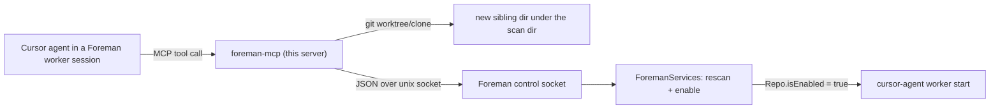

# foreman-mcp

A small [Model Context Protocol](https://modelcontextprotocol.io) **stdio
server** that lets a Cursor agent — typically one running inside a
[Foreman](../Foreman) `cursor-agent worker` session — spin up another working
copy of the repo it's in (a lightweight `git worktree` or a full `git clone`)
and have Foreman immediately start a worker on it. The new copy becomes a
normal Foreman-managed repo: work is dispatched to it exactly like every other
repo, with no separate task/prompt launcher.

It's a Node/TypeScript package, built to `dist/` and registered in
`~/.cursor/mcp.json`. Git creation runs locally via `git`; worker lifecycle and
copy removal are delegated to Foreman over a local unix-domain **control
socket** (see [ForemanCore's control protocol](../ForemanCore/README.md)), so
the same removal path works whether triggered from here or the Foreman UI.

## How it fits together



The MCP owns **creation** git (worktree/clone — its natural domain); Foreman
owns **worker lifecycle and copy removal**.

## Build

Requires Node 18+ (this repo pins Node via `mise`). From this directory:

```bash
npm install
npm run build     # tsc → dist/
npm test          # smoke + integration (mock socket + a temp git repo)
```

`npm run watch` rebuilds on change; `npm run smoke` runs just the ping check.

## Registration

Add (or merge) an entry in `~/.cursor/mcp.json` so the server is available to
any repo / any Foreman worker. Point `command` at the Node binary and `args` at
the built `dist/index.js`:

```json
{
  "mcpServers": {
    "foreman": {
      "command": "/absolute/path/to/node",
      "args": ["/absolute/path/to/Foreman/foreman-mcp/dist/index.js"],
      "env": {
        "FOREMAN_CONTROL_SOCKET": "${userHome}/Library/Application Support/com.stuff.foreman/control.sock"
      }
    }
  }
}
```

`FOREMAN_CONTROL_SOCKET` is optional — it defaults to the same path — but
setting it explicitly documents the contract. Rebuild (`npm run build`) after
changing the server; Cursor re-launches the stdio process. MCP tools may need a
one-time trust/approval in Cursor.

## Tools

- **`foreman_ping(message?)`** — health check; returns `pong` (optionally
  echoing `message`) so you can confirm the server is reachable.
- **`spinup_repo_copy(mode, sourceRepo?, name?, branch?, baseRef?, enable=true)`**
  — create another copy of a git repo and (by default) start a worker on it.
  - `mode`: `"worktree"` (fast, shares the object store, one branch per copy)
    or `"clone"` (a fully independent copy).
  - `sourceRepo`: absolute path to the source repo (defaults to the server's
    working directory); must be a git repo.
  - `name`: single directory name for the copy (defaults to
    `<repo>-<branch|shortId>`); a path is rejected, and a collision
    auto-suffixes `-2`, `-3`, ….
  - `branch`: branch to check out (defaults to `foreman/<name>`); `baseRef` is
    the ref it starts from (defaults to the source's `HEAD`).
  - The copy is placed as a sibling under **Foreman's** scan directory (queried
    over the socket) so Foreman discovers it — falling back to the source's
    parent when Foreman isn't running.
  - `enable`: when true and Foreman is reachable, calls `adopt` so a worker
    starts; when Foreman is down (or `enable=false`) the git copy still
    succeeds and the reply says plainly that no worker was started.
- **`list_repos()`** — the repos Foreman knows about, each with its worker
  state and (for copies) how it was created.
- **`remove_repo_copy(path)`** — delegates to Foreman: it stops the worker,
  then removes the worktree (`git worktree remove`) or moves the clone to the
  Trash. Only works on copies Foreman recorded provenance for, and requires
  Foreman to be running.

## How it works

- **Transport** — stdio (`@modelcontextprotocol/sdk`). stdout carries JSON-RPC,
  so **all** diagnostics go to stderr only (`log()`), never stdout.
- **Git** ([`src/git.ts`](src/git.ts)) — thin `execFile` wrappers. GUI-launched
  processes don't inherit the shell `PATH`, so `git` is located at its known
  install paths before falling back to a `PATH` lookup; non-zero exits throw a
  `GitError` carrying stderr (never swallowed).
- **Control client** ([`src/control.ts`](src/control.ts)) — connects to the
  unix socket, writes one JSON request line, reads one JSON response line. The
  wire types mirror `ForemanCore/Sources/ControlProtocol.swift` — **keep the
  two in sync**. A missing/refused socket or a timeout throws
  `ForemanUnavailableError` (callers degrade gracefully); an `ok:false` reply
  throws `ForemanError`.

## Limitations

- Requires **Foreman running** for worker start (`enable`) and for removal; git
  creation works regardless.
- macOS-oriented (the socket path lives under `~/Library/Application Support`,
  and clone removal trashes via Foreman on macOS).
- Discovery is shallow: the copy must land directly under the scan directory
  for Foreman to see it (which is where `spinup_repo_copy` places it).
