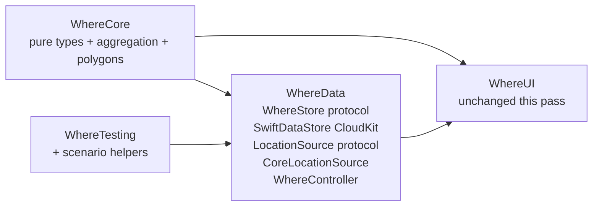

# Where – Data Foundation

## Overview

Add a new `WhereData` SPM module that owns persistence, GPS sampling, evidence storage, and the high-level `WhereController` API. Persistence is SwiftData + CloudKit hidden behind a swappable protocol. Region attribution uses bundled GeoJSON polygons for California, New York, Canada, and the EU. Tests include unit coverage and snapshot tests of full simulated-year aggregations via swift-snapshot-testing.

## Goals

- Add `WhereData` package target with a public `WhereController` that orchestrates GPS ingestion, day attribution, evidence storage, and persistence.
- Keep `WhereCore` as the pure-value/aggregation layer (no I/O, no SwiftData, no CoreLocation), so attribution rules stay easy to unit-test and reuse.
- Persistence hidden behind a protocol (`WhereStore`) with a real SwiftData+CloudKit implementation and an in-memory test double.
- GPS hidden behind a protocol (`LocationSource`) with a CoreLocation implementation (Visits + Significant-Change) and a scriptable test double.
- Bundle simplified polygons for California, New York, Canada, and the EU for fully offline, deterministic region attribution. Everything else falls into `.other`.
- Add `swift-snapshot-testing` as a test-only dependency and snapshot full-year aggregations as JSON/text.
- No UI changes in this pass (`RootView` untouched); UI is a follow-up plan.

## Module layout



### `WhereCore` (extended)

Pure-value layer. No CoreLocation, no SwiftData.

- `Region` (enum: `.california`, `.newYork`, `.canada`, `.europeanUnion`, `.other`) — a single, generalized place identifier; not US-specific. Easy to extend with more cases (e.g. another US state, UK, Mexico) later.
- `LocationSample { id: UUID, timestamp: Date, coordinate: Coordinate, horizontalAccuracy: Double, source: SampleSource }` where `SampleSource = .gpsVisit | .gpsSignificantChange | .manual | .evidenceImplied`.
- `Coordinate { latitude: Double, longitude: Double }` (kept pure so `WhereCore` does not import CoreLocation).
- `DayPresence { date: Date /* day in calendar TZ */, regions: Set<Region> }` — multi-region day support (e.g. CA+NY on a same-day flight, or NY+EU on an overnight flight that crosses midnight in the user's calendar TZ).
- `YearReport { year: Int, days: [DayPresence], totals: [Region: Int] }` with deterministic `Codable` ordering for snapshot stability.
- `RegionAttributor`: point-in-polygon over bundled GeoJSON; returns a `Region` for a coordinate. Polygons for California, New York, Canada, and the EU ship in `Where/WhereCore/Sources/Resources/`. Coordinates that match none fall into `.other`.
- `DayAggregator`: pure function `([LocationSample], Calendar, TimeZone) -> [DayPresence]`. Implements the rule "any sample in a region during a calendar day counts the day for that region; days with no in-region samples are `.other`-only or empty".

### `WhereData` (new)

```
Where/WhereData/
  Sources/
    Persistence/
      WhereStore.swift          // protocol
      SwiftDataStore.swift      // @Model types + CloudKit container
      InMemoryStore.swift       // test/preview double
    Location/
      LocationSource.swift      // protocol (AsyncStream of LocationSample)
      CoreLocationSource.swift  // Visits + significant-change implementation
    Evidence/
      Evidence.swift            // value type: id, kind, capturedAt, region?, note
      EvidenceBlobStore.swift   // protocol for blob bytes (CKAsset-backed in prod)
    WhereController.swift       // public top-level API
  Tests/                        // wired via Project.swift
```

Key APIs:

- `protocol WhereStore: Sendable` — `addSample`, `samples(in: DateInterval)`, `addEvidence`, `evidence(in:)`, `setManualDay(_:)`, `manualDays(in:)`, `clear(in:)`.
- `protocol LocationSource: Sendable` — `var sampleStream: AsyncStream<LocationSample> { get }`, `var authorizationStream: AsyncStream<LocationAuthorizationStatus> { get }`, `start()`, `stop()`, `requestAlwaysAuthorization()`.
- `public actor WhereController` — composes a `WhereStore`, `LocationSource`, `RegionAttributor`, and a `DayAggregator`. Exposes:
  - `func ingest(_ sample: LocationSample) async throws` (used by GPS source and tests).
  - `func addManualSample(_:)`, `func addManualDay(date:, regions:)` for retroactive entry.
  - `func addEvidence(_:, blob: Data?)`, `func evidence(for: Int)`, `func evidenceBlob(for: UUID)`.
  - `func yearReport(for year: Int) async throws -> YearReport`.
  - `func clearYear(_: Int)`.
  - `func startGPS()` / `func stopGPS()` / `func requestAlwaysAuthorization()`.

### CloudKit / persistence notes

- `SwiftDataStore` is a `@ModelActor` and uses `ModelConfiguration(cloudKitDatabase: .automatic)` when CloudKit is enabled.
- Evidence blob bytes use `@Attribute(.externalStorage)` so CloudKit gets `CKAsset`-style chunking automatically.
- `@Model` types are internal to `SwiftDataStore.swift`; the protocol only traffics in `WhereCore` value types so the rest of the app never sees SwiftData.

## Package + Tuist wiring

- [Package.swift](../Package.swift):
  - Added `.package(url: "https://github.com/pointfreeco/swift-snapshot-testing", from: "1.19.2")`.
  - Added `WhereData` target (depends on `WhereCore`) and library product.
  - Added `WhereCore` resources entry for bundled GeoJSON: `resources: [.process("Resources")]`.
- [Project.swift](../Project.swift):
  - Extended the `unitTests` helper to accept `extraPackageProducts:` and added a `WhereDataTests` target with `productDependency: "WhereData"` + `extraPackageProducts: ["SnapshotTesting"]`.

## Tests

All tests use Swift Testing (`import Testing`).

- `WhereCoreTests`:
  - Point-in-polygon spot checks: SF, LA, NYC, Buffalo, Toronto, Montreal, Paris, Berlin, plus near-border negatives (Reno just outside CA, Newark just outside NY, Tijuana just south of CA, London just outside the EU).
  - `DayAggregator` rules: single-region day, dual-region day (cross-country flight, transatlantic flight that crosses midnight), neither-region day (Mexico stopover), empty day.
  - Calendar/timezone boundary cases (sample at 11:59pm PT vs 2am ET next-day).
  - Codable round-trip and deterministic region ordering.
- `WhereDataTests`:
  - `InMemoryStore` round-trips samples, evidence, manual entries; `clear(in:)` wipes across all tables.
  - `WhereController` ingest pipeline produces correct `YearReport` and supports retroactive day entries and evidence.
  - **Simulated-year test**: a fixture (`SimulatedYear`) that drives the controller through 2026 with mixed samples (residency stretches in CA and NY, several round-trip flights between CA and NY, one Canada trip, one EU trip, a 7-day no-GPS gap, retroactive manual entries to backfill a no-GPS stretch, and 3 evidence attachments).
    - Unit assertions on totals (CA = 250, NY = 94, Canada = 7, EU = 13; days = 356; 8 dual-region flight days; attribution sum check).
    - **Snapshot tests** via `assertSnapshot(of: yearReport, as: .json(encoder))` against a stable JSON encoding of the `YearReport` (`prettyPrinted + sortedKeys + iso8601` dates); also `.lines` snapshot of a hand-rolled `MonthlySummary.text` for quick at-a-glance reviewability.
    - Retroactive-entry test that mutates Nov 13 (a no-GPS day) and re-checks totals.

`@Suite(.snapshots(record: .missing))` on the snapshot suite so the first run silently records references and subsequent runs compare against them.

## Out of scope (followup plans)

- Any `WhereUI` / `RootView` changes (calendar, year summary, day detail, evidence picker, GPS opt-in flow).
- Info.plist location-usage strings on the `Where` app target (will be added with the GPS-enablement UI plan so the auth prompt has user-facing context).
- Background task scheduling for proactive uploads / report regeneration.
- Export / share-sheet of `YearReport` for audit handoff.
- Higher-fidelity polygons; the bundled simplified ones are correct at the resolution of our spot-check test cities but should be replaced with public-domain GeoJSON for production-grade accuracy.
