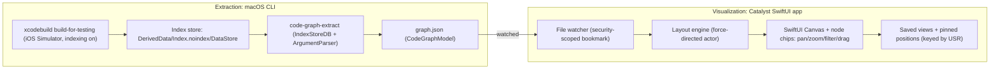

# Swift Code Graph Visualizer ("CodeGraph")

A self-contained tool under `Tools/CodeGraph/`, decoupled from the iOS Tuist targets. Two processes share one Codable schema:

- **`code-graph-extract`** — a macOS command-line tool (SwiftPM, links `IndexStoreDB` + `ArgumentParser`). Builds/locates an index store, harvests every symbol and relationship, and writes `graph.json`. Has a `--watch` mode.
- **CodeGraph viewer** — a Mac Catalyst SwiftUI app (its own standalone Tuist project). Watches `graph.json`, runs a force-directed layout, and renders an interactive canvas with filtering, manual drag, and saved views.

This split exists because `IndexStoreDB` dynamically loads `libIndexStore` from the toolchain and reads a *build artifact* — it belongs in a CLI, not a sandboxed Catalyst app. The viewer never links it; it only reads a user-granted JSON file.

## Architecture



Why this matters for the choices you made:
- **IndexStore is build-gated**: the `WhereCore`/`WhereUI`/etc. modules are iOS-only (`Package.swift` declares `.iOS(.v26)`; `Project.swift` line 3 `destinations: [.iPhone, .iPad]`), so the index only exists after an iOS-simulator build. "Live" updates therefore land after a build/index pass, not on every keystroke.
- **`--index-store-path` = both**: default to a dedicated reproducible build into `.codegraph/DerivedData`, but accept a custom path to attach to your normal Xcode DerivedData.

## Repo layout (new, all under `Tools/CodeGraph/`)

```
Tools/CodeGraph/
  Package.swift                 # SwiftPM: CodeGraphModel (lib) + code-graph-extract (exe)
  Sources/
    CodeGraphModel/             # shared Codable schema, no deps
    code-graph-extract/         # CLI: IndexStoreDB + ArgumentParser
  Viewer/                       # standalone Tuist project (Catalyst app)
    Project.swift               # references Package.local(path: "..") -> links CodeGraphModel only
    Sources/
  run.sh                        # build -> extract -> open viewer
  README.md
  .gitignore                    # .codegraph/ (DerivedData, graph.json)
```

The viewer depends only on `CodeGraphModel`, never on the extractor or `IndexStoreDB`.

## Shared schema (`CodeGraphModel`)

Extract everything; filtering is purely a viewer concern (per your "having data and discarding is better than it not existing").

```swift
public struct CodeGraph: Codable, Sendable {
    public var generatedAt: Date
    public var repoPath: String
    public var commit: String?
    public var modules: [Module]      // name, target kind, deps
    public var nodes: [Node]
    public var edges: [Edge]
}

public struct Node: Codable, Sendable, Identifiable {
    public var id: String             // USR (stable across re-extraction)
    public var name: String
    public var kind: NodeKind         // class/struct/enum/protocol/actor/extension/func/var/typealias/associatedtype/module
    public var module: String
    public var origin: Origin         // firstParty / external / test
    public var parentID: String?      // owning type or module (membership)
    public var file: String?
    public var line: Int?
    public var isGeneric: Bool
}

public struct Edge: Codable, Sendable, Identifiable {
    public var id: String
    public var source: String         // USR
    public var target: String         // USR
    public var kind: EdgeKind         // see mapping below
    public var viaMemberID: String?   // property/func the reference flowed through
    public var count: Int             // collapsed duplicate references
}
```

## IndexStore -> edge mapping (all 8 kinds)

`code-graph-extract` opens the DB, enumerates symbols, and reads each symbol's `relations`/occurrence `roles`:

```swift
import IndexStoreDB
let lib = try IndexStoreLibrary(dylibPath: libIndexStorePath) // `xcrun --find` toolchain libIndexStore.dylib
let db = try IndexStoreDB(storePath: storePath,               // .../Index.noindex/DataStore
                          databasePath: tmpDBPath, library: lib,
                          waitUntilDoneInitializing: true, listenToUnitEvents: true)
db.pollForUnitChangesAndWait()
```

- **inheritance / conformance**: relation `.baseOf`; classify by the base symbol's kind (class base -> `inheritance`, protocol base -> `conformance`). Handles multi-conformance like `SwiftDataStore: WhereStore, EvidenceBlobStore`.
- **override**: relation `.overrideOf`.
- **membership / nesting**: relation `.childOf` (sets `parentID`; drives expand/collapse of members).
- **property / stored-field types**: type occurrence with role `.reference` whose `.containedBy` is a `var`/`let` -> `propertyType` (e.g. `WhereSession.report: YearReport?`).
- **function / initializer signature types**: type references contained by `func`/`init`/`subscript` -> `paramOrReturnType`.
- **construction / DI**: occurrences with role `.call`/`.reference` to an initializer or type contained by a func/var -> `construction` (e.g. assembling `WhereServices`).
- **generics / associated types**: `associatedtype` symbols and their base/reference relations -> `genericConstraint` / `associatedType`.
- **module dependencies**: from the target graph (`Package.swift` + viewer-side parse of cross-module references) -> `moduleDependency`.

Origin tagging: `firstParty` for symbols under the repo root, `test` for symbols in `*/Tests/**` or `*Tests` modules, `external` for everything else (Apple SDK, ZIPFoundation) emitted as leaf nodes.

## Index acquisition (default = dedicated build)

`code-graph-extract` runs (override with `--index-store-path`):

```bash
xcodebuild build-for-testing \
  -workspace Stuff.xcworkspace -scheme Stuff-Workspace \
  -destination 'platform=iOS Simulator,name=iPhone 17,OS=26.2' \
  -derivedDataPath Tools/CodeGraph/.codegraph/DerivedData \
  COMPILER_INDEX_STORE_ENABLE=YES
```

`build-for-testing` on the aggregate scheme compiles libs + app + test bundles, so the "everything" scope (incl. tests) is indexed. Requires a prior `tuist generate --no-open`.

## Viewer (native SwiftUI, Catalyst)

- **Load/watch**: open-panel a `graph.json`, keep a security-scoped bookmark, hot-reload on change (DispatchSource/`NSFilePresenter`). No process spawning, sandbox stays on.
- **Layout engine**: a background `actor` running a force-directed simulation (velocity-Verlet springs + repulsion, module-cluster gravity), deterministic seed, settles then idles. Manually dragged nodes become pinned and the sim respects them. (Phase 2: a layered/Sugiyama layout for DAG views like inheritance and module deps.)
- **Render/interact**: SwiftUI `Canvas` draws edges (fast for hundreds of edges); an overlay of positioned node "chips" handles hit-testing, selection, and drag; pan + magnification gestures with a scale transform; inspector popover; expand/collapse a type's members.
- **Filter**: by module, node kind, edge kind, origin (first-party/external/test), name search, and neighborhood focus (N hops from a selection). All client-side over the full graph.
- **Persist**: pinned positions (keyed by USR), active filters, layout choice, and named saved "views" in the app container. On re-extraction, positions for surviving USRs are kept; new nodes auto-place; removed nodes drop.

## Key risks / decisions baked in

- **`IndexStoreDB` toolchain match**: pin `indexstore-db` to the branch matching the active Swift toolchain (e.g. `release/6.2`); resolve `libIndexStore` via `xcrun`.
- **Catalyst sandbox**: viewer only reads a user-granted file; the CLI does all privileged work. (App-driven builds were explicitly out — that would require disabling the sandbox.)
- **Biggest effort = the layout engine + canvas**; it is phased so an early version (force-directed + drag + filter) is usable before layered layouts and member expansion land.
- **SwiftSyntax** is intentionally *not* in the MVP (you chose IndexStore); it can later augment exact type spelling/cardinality (e.g. `[WhereStore]?`) if the bare reference edges feel too lossy.

## Process note

Per the repo's "Working on plans" convention: branch first, one commit per to-do, and run `./swiftformat --lint` before each commit. The CLI/extractor builds and runs on macOS only.